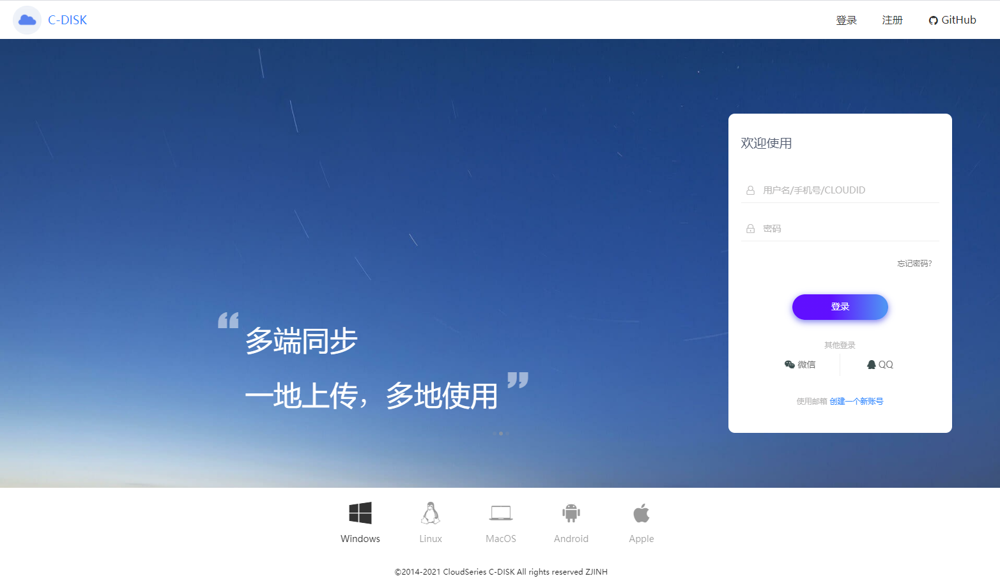
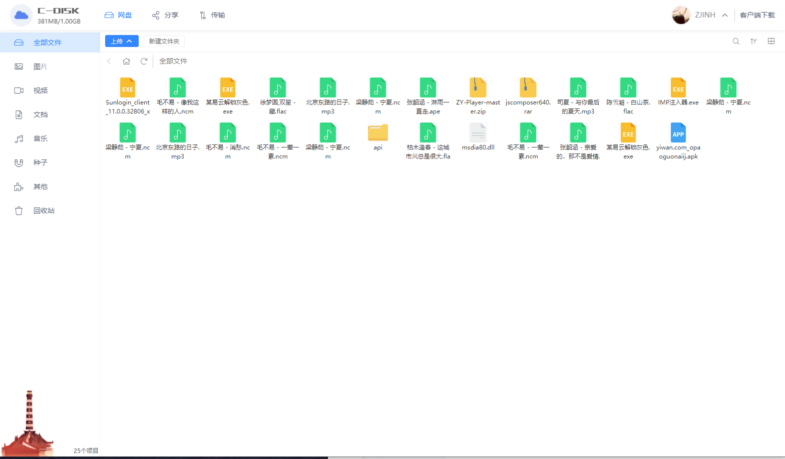
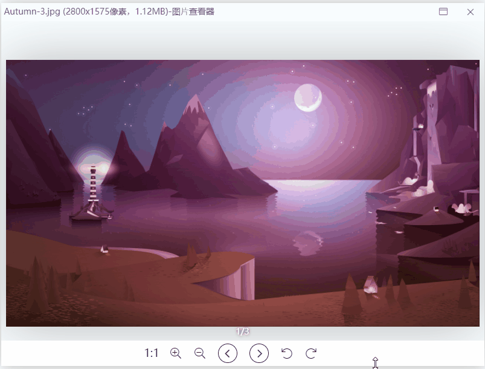
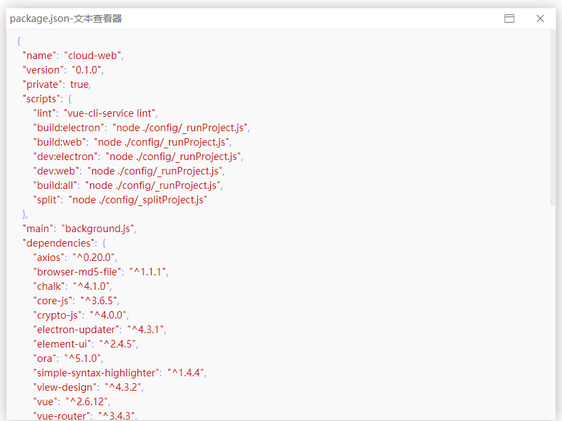
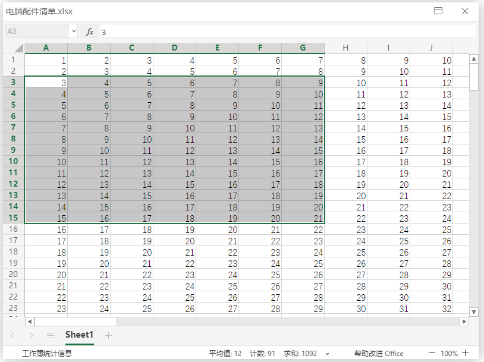
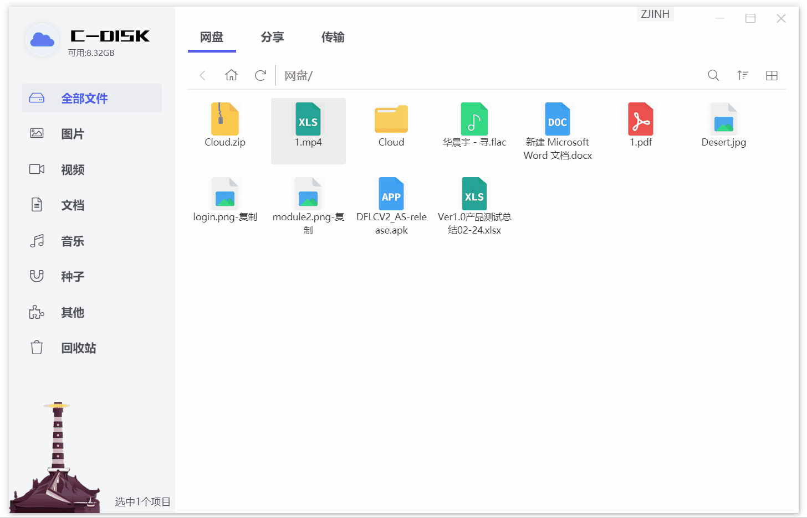
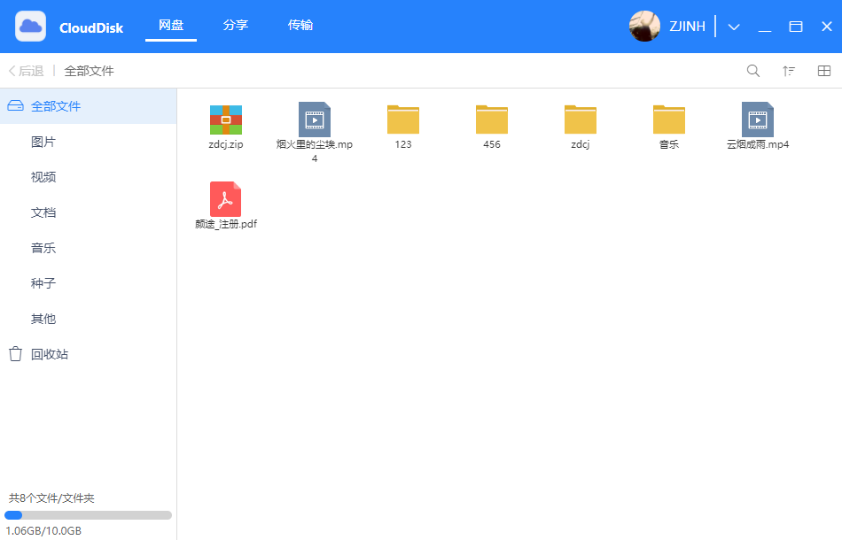
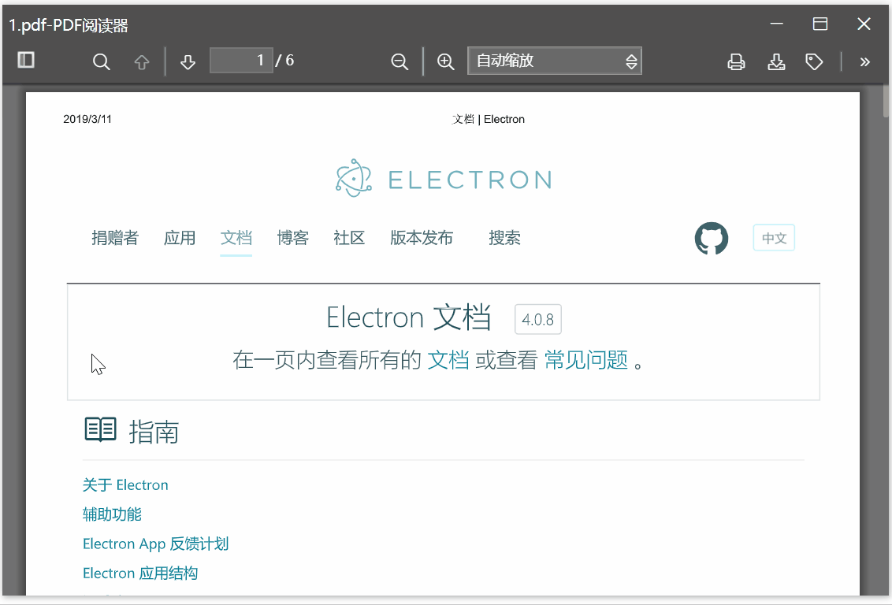
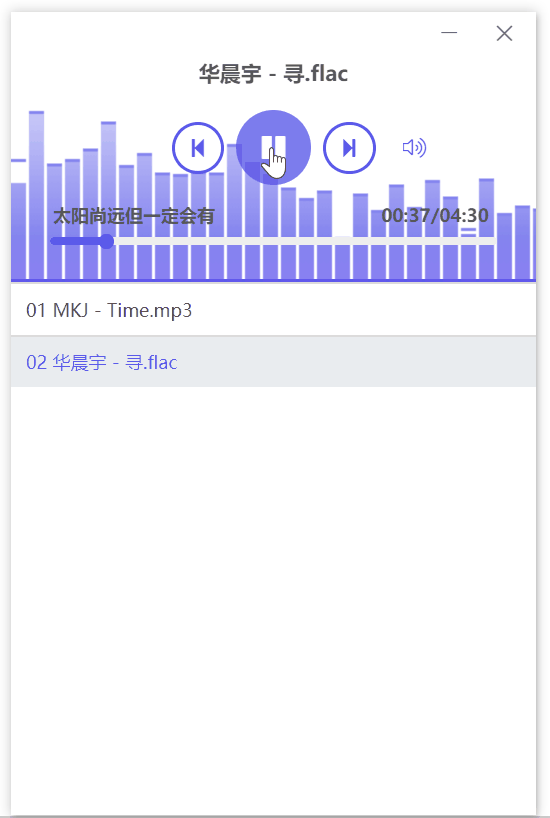
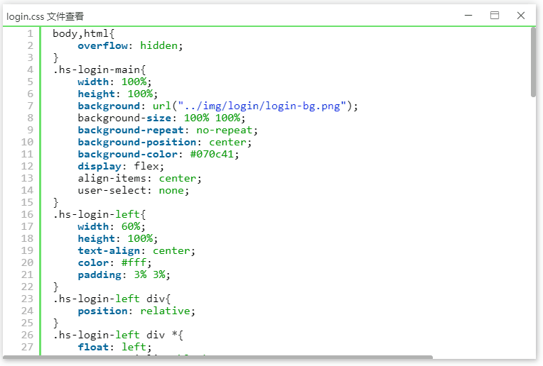

# CloudDisk(C-DISK)
## 项目正在重构，重构后暂不开源:smile:
## 重构均已完成
## 新版项目支持直接生成web或者electron应用

> C-DISK
## 体验
- 旧版：[点我下载](https://works.zjinh.cn)
- 重构版：[点我前往/下载](https://disk.zjinh.cn)
- 体验账号：用户密码均为123
## Cloud系列项目
- [C-Disk(重构版)](https://disk.zjinh.cn)
- [C-Weather(重构版)](https://weather.zjinh.cn/)
- [CloudWeb(重构版](https://cloud.zjinh.cn/)


- [CloudWeather(git)](https://github.com/zjinh/CloudWeather)
- [CloudMusic(git)](https://github.com/zjinh/CloudMusic)

## 基础框架
- [electron-vue-cli3](https://github.com/zjinh/electron-vue-cli3)
## 个人博客
- [Blog](https://blog.zjinh.cn/)

## ✨ 新版亮点
- 🕹 新的UI界面
- 💾 支持断点上传下载文件（网页版仅支持上传断点）
- 🔔 传输任务完成通知提醒
- 💾 支持极速秒传文件（服务端支持）
- ✨ 在线解压200M以下文件（服务端支持）
- ✨ 指定解压压缩包内指定的文件（服务端支持）
- ✨ 在线生成压缩文件（服务端支持）
- ✨ 支持拖拽文件夹上传
- ✨ 支持设置传输阈值（之前是假的）
- ✨ 音乐文件在线查看
- ✨ 全新的视频文件在线查看
- ✨ 全新的图片文件在线查看
- ✨ 全新的pdf文件在线查看
- ✨ ppt、word、excel文件在线查看
- ✨ 多种文本文件在线查看，部分支持代码高亮
## 🖥 应用界面
#### 主界面


#### 图片查看工具

#### 视频播放器

#### 文本查看工具

#### excel查看工具

#### 更多预览请前往项目吧....


> --------------------旧版分界线--------------------------
## 🖥 应用界面
#### 主界面
   
   
#### pdf阅读器
  
#### 音乐播放器

#### 视频播放器

#### 图片查看工具

#### 代码查看工具

---
## 头脑发热开发的网盘小应用
偶然机会接触electron，后学习了vue，搬砖之余开发了C-DISK，然而并没有开发完，还有些许问题

C-DISK是一款集上传下载、文件在线查看的工具。

## ✨ 功能亮点
- 🕹 简洁的图形操作界面
- 💾 支持断点上传下载文件
- 🔔 传输任务完成通知提醒
- 🌍 在线解压200M以下文件（服务端支持）
- ✨ 音乐文件在线查看
- ✨ 视频文件在线查看
- ✨ 图片文件在线查看
- ✨ pdf文件在线查看
- ✨ 多种开发文件在线查看，支持代码高亮

## 🛠 使用的技术栈
- [Electron](https://electronjs.org/)
- [electron-vue](https://simulatedgreg.gitbooks.io/electron-vue/content/cn/) 
- [electron-builder](https://www.electron.build/) 
- [Vue](https://vuejs.org/)
- [VueX](https://vuex.vuejs.org/)
- [iView](https://www.iviewui.com/)
- [Element](https://element.eleme.io)

## 🛠 使用的插件
- [syntaxhighlighter](https://github.com/syntaxhighlighter/syntaxhighlighter)

## ⌨️ 本地开发

### 克隆代码
```bash
git clone https://github.com/zjinh/CloudDisk.git
```

### 安装依赖
```bash
cd CloudDisk
npm i
```
### 淘宝的npm源
```bash
npm config set registry 'https://registry.npm.taobao.org'
npm config set ELECTRON_MIRROR='https://npm.taobao.org/mirrors/electron/'
```
或者使用[Yarn](https://yarnpkg.com/)安装依赖

### 运行项目
```bash
npm run dev
```
### 打包项目
```bash
npm run build
```
### 注意:bangbang::bangbang::bangbang:
项目不包含服务端:smile::smile:
