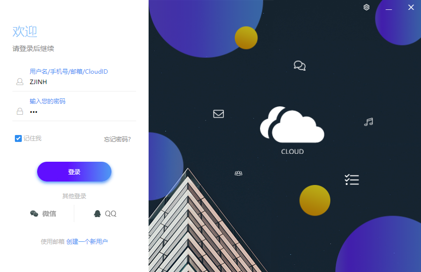
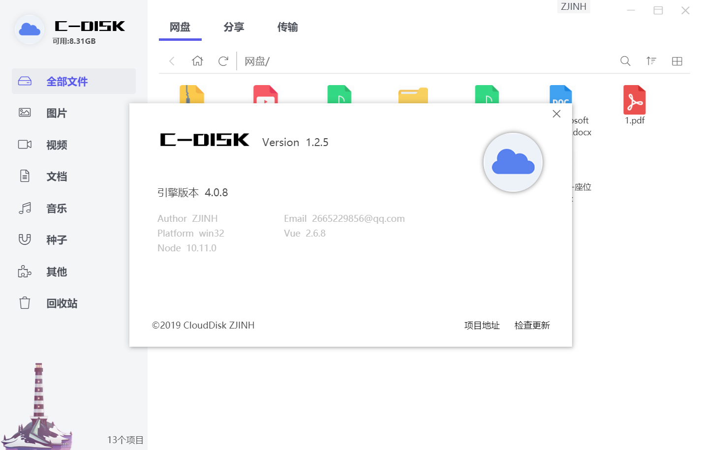
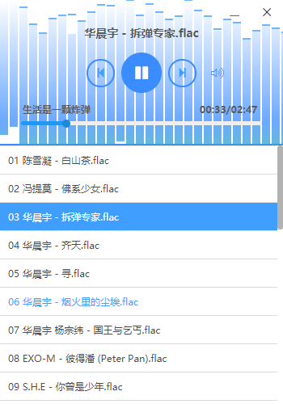
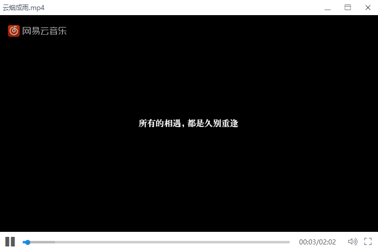
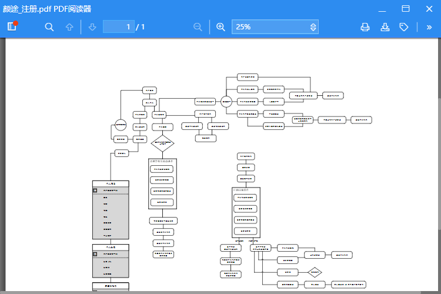

# CloudDisk

> Cloud-网盘

#### 项目效果
#### 登录页面
   
#### 网盘页面
  
#### 网盘页面
  
#### 内置音乐播放器
  
#### 内置视频播放器
  
#### pdf阅读器
  
---
#### Build & Setup

# 安装node模块
npm install

# 运行项目
npm run dev

# 打包项目
npm run build

#### 2018-07-06 
    1、新增排序功能
    2、搜索框实现
    3、右下角实现查看网盘容量信息
    4、分享、传输列表修改为组件状态
    5、添加分页参数
    6、修复图标区分错误的问题
    7、添加滚动加载功能
    8、DiskFile组件的数据计算方法移动到父组件位置
    9、修改头部样式
    10、修复列表模式下文件大小丢失问题
#### 2018-07-08
    1、新增鼠标选择文件功能
    2、新增Ctrl多选功能
    3、登陆新增服务器修改窗口
    4、新增服务器验证方法
    5、引入element对话框组件
    6、增加监听函数，监听选择文件参数及用户网盘参数
    7、搜索参数合并为对象
    8、添加文件选择提示
    9、修复文件选择提示一些错误
    10、新增双击打开文件夹方法
    11、新增导航栏功能
#### 2018-07-09
    1、修复导航栏无法正确指引的问题
    2、OpenFile函数添加类别区分
    3、导航栏后退功能增加
    4、新增文件拖拽选择功能
    5、样式表精简
    6、修复滚动加载没到达底部开始加载的问题
    7、修复搜索点击失焦问题
#### 2018-07-10
    1、修复拖选文件时出现重复文件的问题
    2、修复按住Shift连选无法使用的问题
    3、新增右键菜单控制方法
    4、修改选择文件的记录方式，由原先多个push改为使用watch监听状态插入选择数组
    5、修复右侧内容展示脱动选择和右键菜单冒泡问题
#### 2018-07-11
    1、新建文件夹功能完成
    2、新增插入用户网盘数据统一接口函数
    3、修复右键菜单鬼畜问题
    4、右键刷新功能完成
#### 2018-07-13
    1、重命名功能完成
    2、复制文件夹功能实现
    3、剪切文件功能实现
    4、粘贴功能实现
    5、修改文件地址导航样式
    6、剪切文件增加判断条件
    7、修复右键打开文件在选择多个文件仍然可用的问题
    8、修改复制剪切时多个文件的的提示方法
    9、文件右键增加区别方法
    10、右键菜单代码整理
    11、清空回收站功能完成
    12、登录窗口增加激活码重发功能
    13、还原、彻底删除文件功能实现
    14、新增文件属性窗口
#### 2018-07-14
    1、删除一些可以用其他方法代替的ipc指令
    2、修复打包完成后字体大小的问题
    3、修复打包完登录完成白屏问题
    4、修改了登录页的结构和样式问题
    5、一些主进程的操作改为子进程操作
    6、限制网盘只能启动一个实例
    7、修复打包后图标消失的问题
#### 2018-07-15
    1、修复相同目录下复制后出现点击双选的问题
    2、修复网盘使用条90%下回到低位颜色不变的问题
    3、修复出现confrim框后键盘失效的问题
    4、添加复制剪切粘贴操作等快捷键 
#### 2018-07-16
    1、右键部分功能添加右键菜单
    2、修复一些快捷键功能在不同环境下生效问题
    3、修复分享的文件无法加载的问题
    4、添加复制文件时空间检查方法
#### 2018-07-17
    1、移动到弹窗实现
    2、树目录组件完成
#### 2018-07-19
    1、修复树目录加载无法准确加载到指定目录的错误
    2、树目录展开增加加载动画
    3、修复confrim提示文字不显示的问题
    4、树目录传参vuex实现，出现异常报错，改为emit（报错不影响使用）
    5、右键移动到功能实现
    6、主进程添加打开文件属性窗口方法
    7、文件属性窗口完成
    8、api更新
    9、解决树目录传参 使用树目录子组件递归传参
    10、取消单选框
    11、修复分享地址显示错误的问题
    12、添加分享文件弹窗，新增组件
    13、修复在一些弹框内使用右键出现右键菜单
    14、右键分享功能实现，支持加密分享和公开分享
#### 2018-07-20
    1、修改属性窗口的一些样式
    2、文件格式统一小写判断取消大小写判断
    3、新增内嵌音乐播放器
    4、播放器和任务栏按钮联动
    5、播放器自动搜索当前目录文件生成播放列表
    6、音乐播放器添加可视化效果
    7、修复点击进度条进度更改，播放暂停的问题
    8、修复可视化效果重复音乐的bug
    9、去掉了一些不必要的判断
    10、修复序号列表显示异常的问题
    11、修复音量按钮点击关闭后关闭又展开的问题
    12、添加取消分享功能
    13、zip压缩实现解压功能
    14、新增视频播放器模块
    15、修复用户状态错误返回登录窗口失效的问题
    16、去除一些可以用其他方法取代的ipc通信
#### 2018-07-21
    1、完成视频播放器
    2、修复全屏状态下控制栏消失的问题
    3、增加控制栏的移入移除动画
    4、取消视频切换下一个上一个按钮，默认只播放一个
    5、修复全屏状态下，视频黑边过大问题
    6、音视频处理函数整理为模块使用
    7、去掉Slimf前缀
    8、拦截移动到弹框的报错（不影响使用）
    10、打开文件函数整理，合并一些共有条件
    11、修复音乐播放器播放网最后一首歌仍为播放状态的bug
    12、引入pdf插件
    13、加入pdf阅读器
    14、删除一些没有用的样式表和文件
    15、精简一些目录
    16、增加拖拽拦截
    17、添加PDf加载提示，优化PDF阅读器打开过程
    18、修复视频播放器全屏检测问题
#### 2018-07-22
    1、彻底解决视频播放器全屏问题
    2、音乐播放器添加资源失效自动下一曲功能
    3、窗口控制按钮样式修改
    4、样式表整理到APP.vue
	5、添加歌词解开
	6、音乐添加歌词效果
#### 2018-07-23
    1、添加系统下拉菜单
    2、完成退出功能（后期仍需完善）
    3、完成切换账号功能（后期仍需完善）
    4、主进程严格模式根据生产环境变化
    5、视频播放器音量样式修改
    6、去除:function
    7、个人信息窗口铺设完成
    8、修复个人头像更新，网盘缓存无法更改的问题
    9、添加一些个人信息获取和更新的方法
    10、修复一些打包后运行的错误
    11、修复切换账号出现多个托盘图标的问题
    12、修复切换账号，文件预览窗口不关闭的问题
    13、修改了pdf阅读器一些显示文本
#### 2018-07-24
    1、关于页面铺设完成
    2、主进程细节修改
#### 2018-07-25
    1、修复属性窗口在网盘关闭时仍然存在的问题
    2、属性窗口为单一窗口，多文件共用
    3、实现关于我们检查更新功能
    4、实现版本号获取
    5、修复自动更新出现的错误
    6、electron版本更新
    7、实现更新检测及升级
    8、修复打开个人信息后无法打开关于窗口的问题
    9、增加图片预览窗口
#### 2018-07-26
    1、完成图片查看切换图片功能
    2、完成图片旋转功能
    3、初步完成图片缩放功能
    4、完成图片拖拽功能
    5、增加一些图片效果
    6、图片缩放、拖拽算法修改
    7、图片查看功能完成
    8、优化图片查看器加载
#### 2018-07-27
    1、pdf阅读器代码精简
    2、拆分slimf,css，分为icon.css,共用部分合并入disk.css
    3、压缩iviewer.css
    4、删除pdf阅读器一些图片
#### 2018-07-28
    1、添加文件查看窗口
    2、删除一些重复定义的ipc参数
    3、解决了一些窗口的鼠标拖拽问题
    4、添加代码高亮效果
    5、修复打包后文件查看失效的问题
#### 2018-07-30
    1、断点上传试水，深不可测
    2、网盘分类切换增加了一些逻辑判断
    3、修复网盘切换传输列表更新不及时的问题
    4、优化上传后台代码
    5、添加拖拽上传
    6、支持断点续传
    7、移除了一些没有用的判断
#### 2018-08-01
    1、上传添加限制，不允许拖拽文件夹上传
    2、修改了上传前的提示判断
    3、修复上传过程中选择其他文件上传会失败的问题
    4、修复视频播放器的全屏问题
    5、视频播放器添加按键控制
    6、音乐播放器添加按键控制
    7、图片查看器添加键盘切换
    8、修复音乐播放器无法聚焦的问题
    9、修复视频播放器无法聚焦的问题
    10、修复图片查看器无法聚焦的问题
    11、修复ncm文件识别错误问题
    12、传输列表加入计数器
    13、修改传输列表样式
#### 2018-08-02
    1、添加反馈窗口
    2、完成反馈流程
    3、后台反馈接口更新
    4、修改全局弹框消失时间
    5、添加设置窗口
    6、api接口更新
    7、修复搜索框无法输入的问题
    8、调整全局键盘事件
#### 2018-08-03
    1、修复反馈窗口一些按钮错位问题
    2、修复设置窗口输入框错位问题
    3、node模块升级，代码更新
    4、添加用户密码修改接口
    5、支持设置页面修改密码门
    6、支持设置页面修改传输设置
    7、修复视频全屏后标题栏仍然存在的问题
#### 2018-08-04
    1、优化主进程登录成功后的加载速度
    2、修复pdf查看器顶部白边
    3、api更新邮件更改接口
    4、添加安全邮箱修改功能
    5、添加传输完成提示音
    6、增加设置提示音效功能
    7、添加传输完成提示气泡
    8、设置增加气泡设置功能